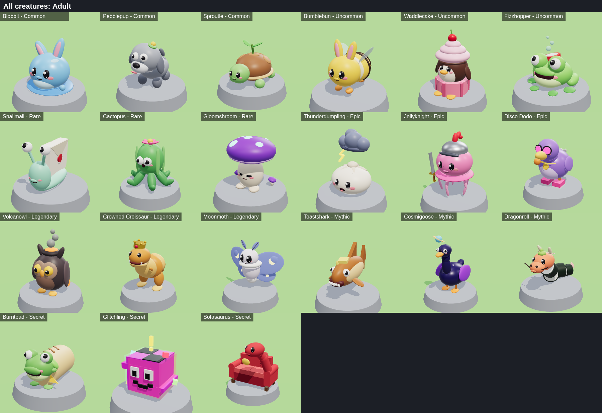
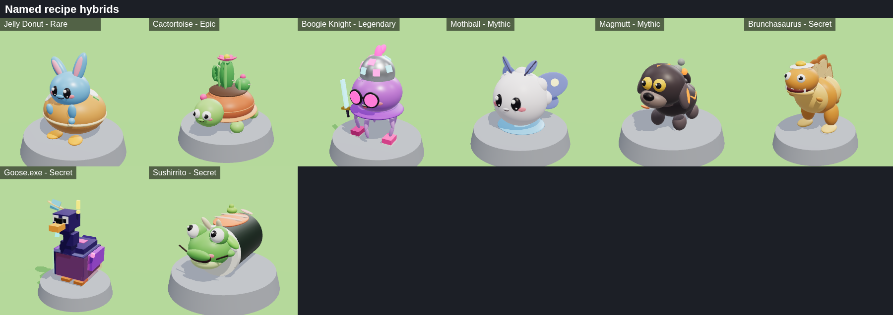
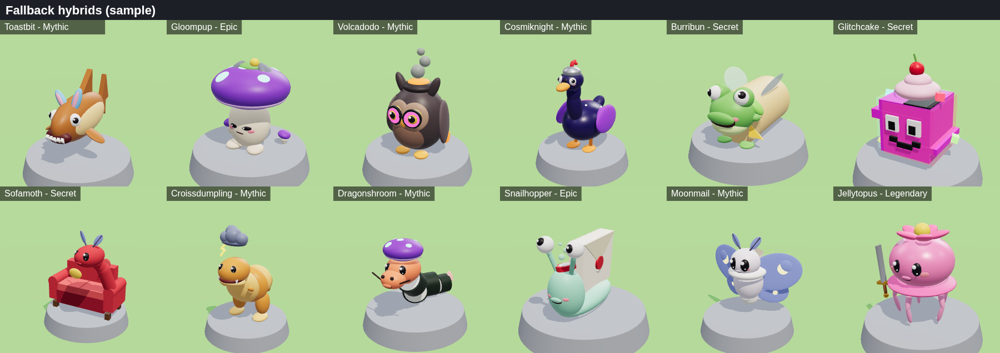

# Hatch & Snatch

A Roblox game: raise weird creatures in your own base, let them grow and earn coins, fuse them
into goofy hybrids, and sneak into other bases at night to snatch creatures (and bonk raiders
out of yours).



Fuse two creatures into a hybrid. Eight secret recipes have their own hand-made look:



Every other pair makes a fallback hybrid. It has the rarer parent's body plus the other
parent's signature piece:



The repository is the source of truth. Every script, and every model, lives here as code and is
synced into Studio with [Rojo](https://rojo.space).

## Status

Done so far:

- Milestone 0: project setup.
- Milestone 1: the core loop (buy eggs, hatch, grow, earn, collect).
- Milestone 2: saving.
- Milestone 3: night raids and PvP.
- Milestone 4: menus, tutorial and sounds.
- Milestone 5: the Fusion Machine, hybrids and the Index.

See [CHANGELOG.md](CHANGELOG.md) for what each milestone adds.

## Getting started

1. Install the tools. The easiest way is [Rokit](https://github.com/rojo-rbx/rokit):
   ```sh
   rokit install
   ```
   This installs the versions pinned in `rokit.toml` (Rojo, Selene, StyLua, Lune).
2. Install the **Rojo plugin** in Roblox Studio: run `rojo plugin install`, or get it from the Creator Store.
3. Pick one of these:
   - **Live sync (recommended while developing).** Run `rojo serve`, open a new Baseplate in
     Studio, and click **Connect** in the Rojo plugin. Then delete the default `Baseplate` part,
     because the game builds its own ground.
   - **Build a place file.** Run `rojo build -o HatchAndSnatch.rbxl` and open that file in Studio.
4. Press **Play**. You spawn inside your own base. A star marker shows which base is yours, and
   the HUD shows your coins and base number. Walk to the conveyor in the lobby and buy an egg
   (press **E**, or tap the prompt on mobile). It lands on a pedestal in your base, hatches and
   grows up, and its coins pile up on the green collect pad by your entrance. Step on the pad to
   collect them.

### One-time Studio settings

- **Game Settings → Places → Max Players: 8.** A server has 8 bases. A 9th player would wait in
  the lobby until a base frees up.
- **Workspace → StreamingEnabled: off.** `rojo build` sets this for you. If you use `rojo serve`
  on an existing place, set it by hand, because Rojo can't change it while live syncing.

To test with several players, use **Test → Clients and Servers → 2 Players → Start**.

## Project layout

```
default.project.json      Rojo project (services, Lighting look, StreamingEnabled off)
src/
  shared/                 -> ReplicatedStorage.Shared
    Config.lua            every tunable number (balance, timings, map layout, debug toggles)
    Remotes.lua           the single registry of RemoteEvents / RemoteFunctions
    Rarity.lua            rarity tiers, colors, weighted roll
    Growth.lua            growth stage math from plantedAt timestamps
    Economy.lua           prices and income formulas (pedestal cost, sell value, income/s)
    Tags.lua              CollectionService tag names
    CreatureData.lua      the 21 creatures plus hybrid lookup (named recipes and fallbacks)
    FusionRecipes.lua     named fusion recipes: pairs of creatures -> hand-made hybrids
    Types.lua             PlayerData / CreatureRecord shapes
    Util/Format.lua       1.2K / 3.4M number formatting, timers
    Util/Signal.lua       tiny event object for service-to-service events
    Models/ModelKit.lua   primitives, rig and face helpers used by every model
    Models/CreatureModels.lua  every creature's Egg / Baby / Adult model, hybrids included
    Models/Gallery.lua    the dev creature showroom layout
  server/                 -> ServerScriptService
    Main.server.lua       bootstrap: remotes, then init/start each service in order
    Services/             DataService, MapService, BaseService, CreatureService,
                          GrowthService, IncomeService, ConveyorService, CycleService,
                          RaidService, CombatService, TrapService, FusionService,
                          TutorialService
    Util/                 Net (validated, rate-limited remotes), Guard (validators), RateLimiter,
                          Ticker (the single server heartbeat), Character (distance checks)
    World/                MapBuilder (lobby, conveyor, 8 bases), FusionMachine, Props
  client/                 -> StarterPlayer.StarterPlayerScripts
    Main.client.lua       bootstrap for controllers
    Controllers/          one per feature (HUD, creatures, conveyor, cycle, shields, raids,
                          combat, menu, fusion, sound, tutorial)
    UI/                   Theme, Widgets, Window, Popup, Banner, Effects, Sounds
    Screens/              Shop, Inventory, Index, Fusion, Settings windows
    State/                client-side state: profile summary, settings, raid rules, your creatures
tests/run.luau            headless tests (Lune)
tools/preview/            renders models to PNG outside Studio (Lune + three.js)
tools/check.sh            runs every automated check
docs/images/              rendered previews of the creatures and the map
```

## How the game code is organised

- **The server decides everything.** Clients only draw UI and visuals.
- **Remotes are guarded.** Server code never listens to a remote directly. `Net.onEvent` and
  `Net.onInvoke` rate-limit every call per player, reject the wrong argument count, run a `Guard`
  validator on each argument, and wrap the handler in `xpcall`.
- **Proximity prompts are checked like remotes.** Buying, selling, unlocking and collecting
  re-check ownership, distance, rate limits and coins on the server before doing anything.
- **One heartbeat.** Periodic work (income, growth, the conveyor) registers with `Ticker`.
- **One bootstrap per side.** It calls `init()` on every service or controller in order, then
  `start()`.
- **Balance lives in Config.** `src/shared/Config.lua` holds every number. The table is
  deep-frozen, so nothing can change it at runtime.
- **Models are code.** `ModelKit` builds creatures from balls, ellipsoids (sphere meshes),
  blocks, wedges and cylinders, with welded parts and an invisible `Root` part. Each model's pivot
  sits on the ground under it, facing -Z. Adults use 22 to 35 parts.
- **The map is code too.** `MapService` builds the map at server start. If `Workspace` already
  contains a hand-built `Map` with the same structure (see the header of `MapBuilder.lua`), that
  map is used instead.

## Development checks

```sh
sh tools/check.sh
```

This runs StyLua (formatting), Selene (lint), a full Rojo build and the Lune test suite. For type
checking, every module is `--!strict`. The VS Code
[Luau Language Server](https://marketplace.visualstudio.com/items?itemName=JohnnyMorganz.luau-lsp)
checks the code as you edit, using Rojo's sourcemap.

### Previewing models without Studio

```sh
lune run tools/preview/export.luau creatures blobbit toastshark   # or no ids for all
lune run tools/preview/export.luau sheets                         # every creature on one sheet
lune run tools/preview/export.luau map                            # lobby, a furnished base, whole map
lune run tools/preview/export.luau recipes                        # the named recipe hybrids
lune run tools/preview/export.luau hybrids [creatureId ...]       # fallback hybrids, 20 per sheet
lune run tools/preview/export.luau machine blobbit toastshark     # the Fusion Machine mid-fusion
cd tools/preview && npm install && node render.mjs                # renders out/*.json to out/*.png
lune run tools/preview/export.luau rbxm                           # build/Creatures.rbxm to drag into Studio
```

## Fusion and first discoveries

First discoveries are saved in the global DataStore named in `Config.DiscoveryStoreName`.
They are announced to other servers on the MessagingService topic `Config.DiscoveryTopic`.
In Studio, turn on **Game Settings → Security → Enable Studio Access to API Services** to
test them for real. Without it, each server remembers its own first discoveries.

## Turning things off before publishing

- `Config.Debug.ShowCreatureGallery = false` hides the creature showroom in the lobby. It's a
  development aid, and it would spoil the Secret creatures.
